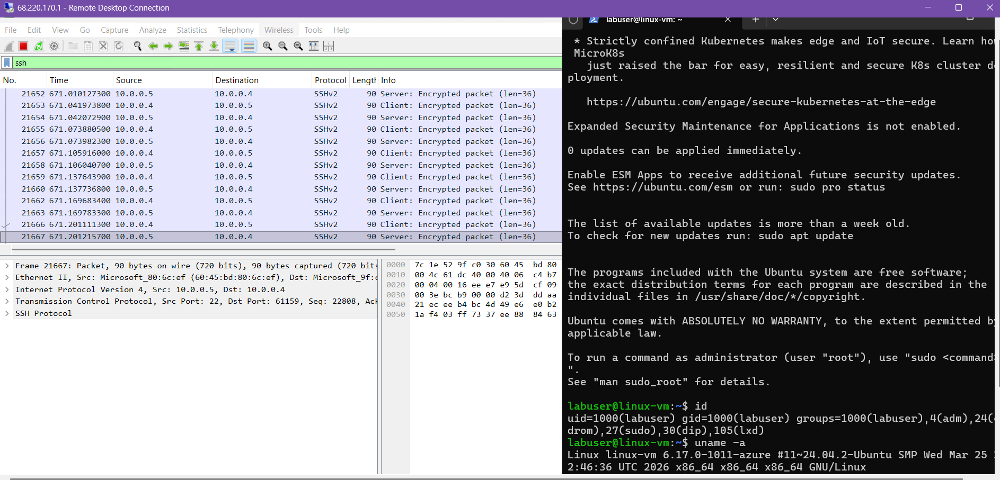

# Azure Network Traffic Analysis & Security Lab

  

## Introduction
This lab demonstrates the deployment of cloud-based virtual machines (VMs) in Azure and the analysis of network traffic using Wireshark. By configuring a virtual network and implementing Network Security Group (NSG) rules, I simulated real-world scenarios to observe and secure various protocols, including ICMP, SSH, DNS, DHCP, and RDP.

---

## Technical Skills & Tools
* **Cloud Platform:** Microsoft Azure
* **Operating Systems:** Windows 10, Linux (Ubuntu 20.04)
* **Network Security:** Network Security Groups (Firewalls), Inbound/Outbound Security Rules
* **Traffic Analysis:** Wireshark (Packet Capture & Protocol Inspection)
* **Connectivity:** Remote Desktop Protocol (RDP), SSH, ICMP (Ping)
* **Networking Protocols:** DNS, DHCP, TCP, UDP

---
## Part 1: Lab Environment & Network Setup
The goal of this phase was to create a secure, isolated sandbox in Azure. This environment requires a Windows workstation for analysis and a Linux node to serve as a network target.

### 1. Network Foundation
* **Resource Grouping:** All assets were organized into a single Resource Group. This approach ensures the entire lab can be managed as one unit and completely removed afterward to prevent unnecessary Azure costs.
* **Virtual Network (VNet) Design:** A private Virtual Network and Subnet were established to act as the communication backbone. This setup ensures that traffic remains internal and isolated from the public internet.

### 2. Virtual Machine Deployment
* **Windows 10 (Analyst Workstation):** This instance serves as the primary hub for the lab. It is used to run Remote Desktop and Wireshark for live packet capture and protocol inspection.
* **Ubuntu Linux (Target Node):** This instance acts as the destination for network tests. For connectivity to work, this VM was placed on the **exact same VNet and Subnet** as the Windows workstation.
* **IP Connectivity:** Both machines were assigned private IP addresses within the subnet, allowing them to "see" and communicate with each other directly.

  
   
  <i>Figure 1: Overview of the Windows and Linux instances running within the Azure Portal.</i>

---

## Part 2: Connectivity & Initial Traffic Observation
Once the virtual machines were running, the next step was to verify that they could communicate within the private network. This phase involves testing the connection and observing the "handshake" between the two systems.

### 1. Establishing Remote Access
* **Remote Desktop Connection:** A secure session was established from the local host to the Windows 10 Analyst Workstation. This workstation serves as the command center for the rest of the lab operations.
* **Wireshark Initialization:** Wireshark was launched on the Windows VM to begin monitoring the network interface. A filter for `ICMP` traffic was applied to cut through the background noise and focus specifically on connectivity tests.

### 2. Testing Internal Connectivity (The Ping)
* **Initiating the Test:** From the Windows command prompt, a ping was sent to the private IP address of the Ubuntu VM. 
* **Protocol Verification:** The "Request and Reply" behavior of the ICMP protocol was observed in real-time. The successful replies confirmed that the Virtual Network was correctly routing traffic between the two different operating systems.
* **Traffic Analysis:** The Wireshark capture provided a clear look at how these packets move across the subnet, showing the source and destination IPs for every request.

  
   
  <i>Figure 2: Using Wireshark to capture successful ICMP traffic, confirming a solid connection between the two nodes.</i>

---

## Part 3: Security Policy & Firewall Configuration
With a stable connection established, the focus shifted to network security. This phase demonstrates how to control traffic flow using Azure Network Security Groups (NSGs) to enforce specific access policies.

### 1. Implementing the "Deny" Rule
* **NSG Modification:** The Network Security Group associated with the Ubuntu VM was accessed to create a new Inbound Security Rule. 
* **Traffic Blocking:** A rule was configured to explicitly **Deny** all ICMP traffic. By setting the priority higher than the default allow rules, this new policy took immediate effect over the network interface.
* **Objective:** This step simulates a common security scenario where non-essential protocols are disabled to reduce the attack surface of a cloud resource.

### 2. Verifying the Security Baseline
* **The "Perpetual Ping":** A continuous ping was initiated from the Windows workstation to the Ubuntu target. 
* **Observing the Block:** Once the new security rule was saved in the Azure portal, the traffic flow stopped instantly. PowerShell began reporting "Request timed out," confirming that the firewall was successfully dropping the packets before they reached the target.
* **Wireshark Confirmation:** The packet capture showed the Echo Requests leaving the Windows VM, but no Echo Replies returning, proving the inbound block was active.

  
   
  <i>Figure 3: Configuring a Deny rule in the Azure Portal to silence the target VM and block incoming ICMP traffic.</i>

---

## Part 4: Protocol Analysis & Network Traffic Observation
The final phase of the lab involved observing various common network protocols in action. By filtering traffic in Wireshark, the behavior of DHCP, DNS, and RDP was analyzed to understand how they support network operations.

### 1. DHCP, DNS, and RDP Analysis
* **DHCP (Dynamic Host Configuration Protocol):** By filtering for `bootp` in Wireshark, the process of the VM requesting and receiving an IP address was observed. This highlighted how the Azure infrastructure automatically manages network assignments for new instances.
* **DNS (Domain Name System):** Traffic was monitored while navigating to external sites like Google.com from the Windows VM. The capture showed the workstation querying Azure's DNS servers to translate domain names into IP addresses.
* **RDP (Remote Desktop Protocol):** A steady stream of TCP traffic on port 3389 was observed. Because the Windows VM was being accessed via Remote Desktop, this provided a live look at how GUI data is continuously transmitted across the network.

### 2. Encrypted vs. Unencrypted Traffic (SSH)
* **SSH Verification:** An SSH session was established to the Ubuntu VM. While previous ICMP (Ping) tests were blocked by security rules, the functional SSH connection confirmed that specific management ports remained open.
* **Security Insight:** Comparing SSH traffic to other unencrypted protocols demonstrated the importance of encryption. The SSH packet payloads remained unreadable, proving that sensitive administrative commands were protected from interception.

  
   
  <i>Figure 4: Using Wireshark filters to isolate and analyze different network protocols (DHCP, DNS, and SSH).</i>

---
## Project Outcome & Key Takeaways
The project successfully established a secure, multi-node cloud environment within Microsoft Azure. By the end of the lab, a functional network was created where traffic was not only monitored in real-time but also actively controlled through cloud-native security policies.

### Core Technical Competencies
* **Cloud Infrastructure Management:** Practical experience provisioning and managing virtualized resources, including Virtual Networks (VNets), subnets, and Network Interfaces (NICs) within the Azure ecosystem.
* **Network Security & Governance:** Expertise in configuring Network Security Groups (NSGs) to implement "Least Privilege" access, effectively reducing the attack surface by blocking non-essential protocols like ICMP.
* **Protocol Analysis & Troubleshooting:** Utilization of Wireshark for deep packet inspection (DPI) to verify the behavior of various protocols (SSH, DNS, DHCP, RDP) and confirm successful encryption for remote management.
* **Security Monitoring:** Development of a "SOC Analyst" mindset by observing live traffic patterns and identifying the immediate impact of firewall rule changes on network connectivity.

---

## Conclusion & Cleanup
To ensure responsible cloud resource management and cost efficiency, the Resource Group was fully decommissioned at the end of the lab. This project demonstrated the ability to bridge the gap between high-level cloud architecture and granular network security analysis.

---
### 🛠️ Technical Assets
* **Architecture Source:** [Azure-Network-Diagram.drawio](./assets/Azure-Network-Security-Lab-Diagram.drawio) 

