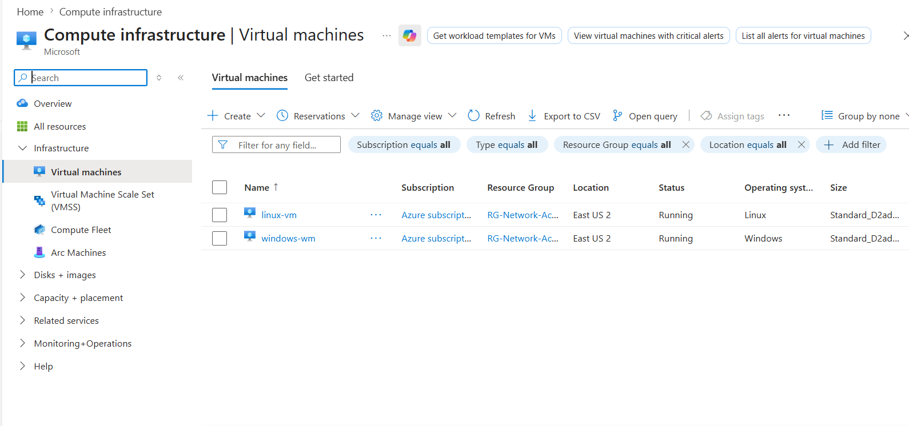
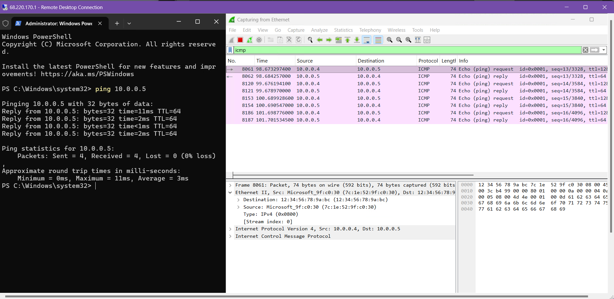
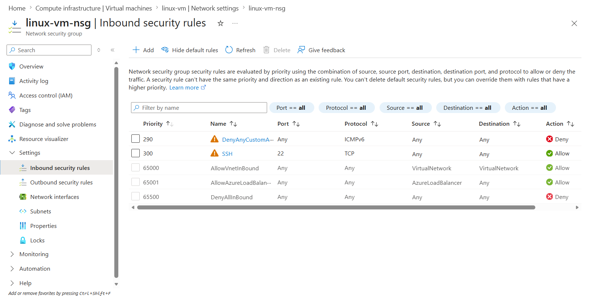

# Azure Network Traffic Analysis & Security Lab

## Introduction
This lab demonstrates the deployment of cloud-based virtual machines (VMs) in Azure and the analysis of network traffic using Wireshark. By configuring a virtual network and implementing Network Security Group (NSG) rules, I simulated real-world scenarios to observe and secure various protocols, including ICMP, SSH, DNS, DHCP, and RDP.

---

## Technical Skills & Tools
* **Cloud Platform:** Microsoft Azure
* **Operating Systems:** Windows 10, Linux (Ubuntu 20.04)
* **Network Security:** Network Security Groups (Firewalls), Inbound/Outbound Security Rules
* **Traffic Analysis:** Wireshark (Packet Capture & Protocol Inspection)
* **Connectivity:** Remote Desktop Protocol (RDP), SSH, ICMP (Ping)
* **Networking Protocols:** DNS, DHCP, TCP, UDP

---
## Part 1: Lab Environment & Network Setup
The goal of this phase was to create a secure, isolated sandbox in Azure. This environment requires a Windows workstation for analysis and a Linux node to serve as a network target.

### 1. Network Foundation
* **Resource Grouping:** All assets were organized into a single Resource Group. This approach ensures the entire lab can be managed as one unit and completely removed afterward to prevent unnecessary Azure costs.
* **Virtual Network (VNet) Design:** A private Virtual Network and Subnet were established to act as the communication backbone. This setup ensures that traffic remains internal and isolated from the public internet.

### 2. Virtual Machine Deployment
* **Windows 10 (Analyst Workstation):** This instance serves as the primary hub for the lab. It is used to run Remote Desktop and Wireshark for live packet capture and protocol inspection.
* **Ubuntu Linux (Target Node):** This instance acts as the destination for network tests. For connectivity to work, this VM was placed on the **exact same VNet and Subnet** as the Windows workstation.
* **IP Connectivity:** Both machines were assigned private IP addresses within the subnet, allowing them to "see" and communicate with each other directly.

  
   
  <i>Figure 1: Overview of the Windows and Linux instances running within the Azure Portal.</i>

---
## Part 2: Connectivity & Initial Traffic Observation
Once the virtual machines were running, the next step was to verify that they could communicate within the private network. This phase involves testing the connection and observing the "handshake" between the two systems.

### 1. Establishing Remote Access
* **Remote Desktop Connection:** A secure session was established from the local host to the Windows 10 Analyst Workstation. This workstation serves as the command center for the rest of the lab operations.
* **Wireshark Initialization:** Wireshark was launched on the Windows VM to begin monitoring the network interface. A filter for `ICMP` traffic was applied to cut through the background noise and focus specifically on connectivity tests.

### 2. Testing Internal Connectivity (The Ping)
* **Initiating the Test:** From the Windows command prompt, a ping was sent to the private IP address of the Ubuntu VM. 
* **Protocol Verification:** The "Request and Reply" behavior of the ICMP protocol was observed in real-time. The successful replies confirmed that the Virtual Network was correctly routing traffic between the two different operating systems.
* **Traffic Analysis:** The Wireshark capture provided a clear look at how these packets move across the subnet, showing the source and destination IPs for every request.

  
   
  <i>Figure 2: Using Wireshark to capture successful ICMP traffic, confirming a solid connection between the two nodes.</i>

---
## Part 3: Security Policy & Firewall Configuration
With a stable connection established, the focus shifted to network security. This phase demonstrates how to control traffic flow using Azure Network Security Groups (NSGs) to enforce specific access policies.

### 1. Implementing the "Deny" Rule
* **NSG Modification:** The Network Security Group associated with the Ubuntu VM was accessed to create a new Inbound Security Rule. 
* **Traffic Blocking:** A rule was configured to explicitly **Deny** all ICMP traffic. By setting the priority higher than the default allow rules, this new policy took immediate effect over the network interface.
* **Objective:** This step simulates a common security scenario where non-essential protocols are disabled to reduce the attack surface of a cloud resource.

### 2. Verifying the Security Baseline
* **The "Perpetual Ping":** A continuous ping was initiated from the Windows workstation to the Ubuntu target. 
* **Observing the Block:** Once the new security rule was saved in the Azure portal, the traffic flow stopped instantly. PowerShell began reporting "Request timed out," confirming that the firewall was successfully dropping the packets before they reached the target.
* **Wireshark Confirmation:** The packet capture showed the Echo Requests leaving the Windows VM, but no Echo Replies returning, proving the inbound block was active.

  
   
  <i>Figure 3: Configuring a Deny rule in the Azure Portal to silence the target VM and block incoming ICMP traffic.</i>

---
